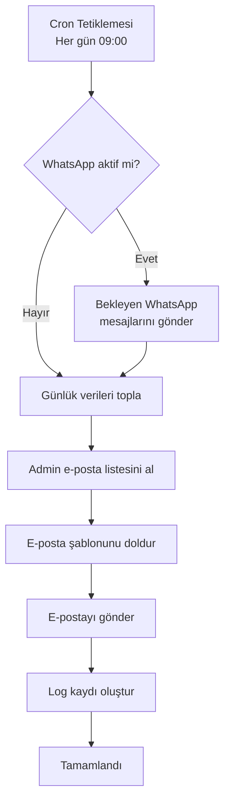

# Günlük E-posta Rapor Sistemi Planı

## 1. Genel Bakış
Her gün otomatik olarak gönderilecek e-posta raporu, bir önceki gün neler yapıldığını ve yaklaşan çek-senet ile banka kredilerini bildirecek.

## 2. Sistem Bileşenleri

### 2.1. WhatsApp Geliştirmeleri
- **Mevcut Durum**: WhatsApp servisi simülasyon modunda çalışıyor, gerçek gönderim yapmıyor.
- **Yapılacaklar**:
  1. Evrak detay sayfasına WhatsApp butonu ekle (ChatBubbleLeftRightIcon)
  2. WhatsApp servisini gerçek API entegrasyonu ile güncelle (CallMeBot API veya Twilio)
  3. Ayarlar sayfasındaki telefon numarası ve mesaj şablonunu kullan

### 2.2. Günlük E-posta Rapor Sistemi
- **Zamanlama**: Her gün sabah 09:00 (mevcut WhatsApp cron ile aynı)
- **Alıcılar**: Tüm admin kullanıcıları (profiles tablosunda role='admin' olanlar)
- **İçerik**:
  - Bir önceki gün eklenen çek/senetler (sayı, toplam tutar, detay listesi)
  - Durumu değişen evraklar (eski/yeni durum, cari, tutar)
  - Yaklaşan vadeli çek/senetler (7 gün içinde vadesi gelecekler)
  - Yaklaşan kredi taksitleri (7 gün içinde ödeme tarihi olanlar)
  - Özet tablolar ve detaylı listeler

## 3. Teknik Uygulama Adımları

### 3.1. Veritabanı Fonksiyonları
```sql
-- Günlük aktiviteleri çeken fonksiyonlar
-- 1. Bir önceki gün eklenen evraklar
-- 2. Bir önceki gün durumu değişen evraklar  
-- 3. 7 gün içinde vadesi gelecek evraklar
-- 4. 7 gün içinde ödeme tarihi olan kredi taksitleri
```

### 3.2. E-posta Altyapısı
- **Seçenek 1**: Nodemailer ile SMTP (Gmail, Office 365, vs.)
- **Seçenek 2**: SendGrid/Mailgun API
- **Ayarlar**: .env dosyasında SMTP bilgileri veya API key

### 3.3. Cron Job Güncellemesi
- Mevcut `whatsapp-cron.ts` dosyasını genişlet
- Yeni bir `email-cron.ts` fonksiyonu oluştur
- Netlify Scheduled Functions kullanımı

### 3.4. E-posta Şablonu
- HTML formatında responsive tasarım
- Özelleştirilebilir şablon (ayarlar tablosunda saklanabilir)
- Türkçe dil desteği

## 4. İş Akışı (Mermaid Diagram)



## 5. Dosya Yapısı

```
src/
├── lib/
│   ├── email.ts                # E-posta gönderme servisi
│   ├── daily-report.ts         # Günlük rapor verilerini toplama
│   └── whatsapp.ts             # Güncellenmiş WhatsApp servisi
├── app/api/cron/
│   ├── whatsapp/route.ts       # Mevcut WhatsApp cron
│   └── daily-email/route.ts    # Yeni e-posta cron endpoint
├── netlify/functions/
│   ├── whatsapp-cron.ts        # Mevcut fonksiyon
│   └── daily-email-cron.ts     # Yeni e-posta cron fonksiyonu
└── components/
    └── evrak/
        └── WhatsAppButton.tsx  # Evrak detayında WhatsApp butonu
```

## 6. Geliştirme Süreci

1. **WhatsApp butonunu evrak detay sayfasına ekle** (Code mode)
2. **WhatsApp servisini gerçek API ile güncelle** (CallMeBot entegrasyonu)
3. **E-posta gönderme servisi oluştur** (Nodemailer)
4. **Günlük rapor veri toplama fonksiyonları yaz**
5. **Yeni cron endpoint ve Netlify fonksiyonu oluştur**
6. **E-posta HTML şablonu tasarla**
7. **Test et ve canlıya al**

## 7. Çevresel Değişkenler (.env)

```
# WhatsApp API
WHATSAPP_API_KEY=callmebot_api_key
WHATSAPP_PHONE=905551234567

# E-posta SMTP
SMTP_HOST=smtp.gmail.com
SMTP_PORT=587
SMTP_USER=email@firma.com
SMTP_PASS=password

# Veya SendGrid
SENDGRID_API_KEY=your_sendgrid_key
```

## 8. Test Senaryoları

1. Manuel olarak cron endpoint'ini tetikleme
2. E-posta içeriğinin doğruluğunu kontrol etme
3. WhatsApp mesaj gönderim testi
4. Admin listesinin doğru alınması
5. Hata durumlarında log kaydı

---

**Not**: Bu planı onayladıktan sonra Code mode'a geçip implementasyona başlayabiliriz.